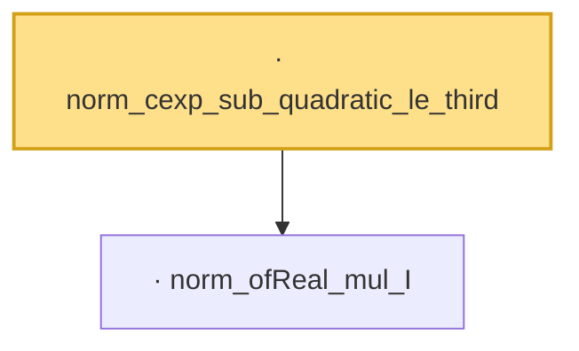

# Proof narrative — norm_cexp_sub_quadratic_le_third

Root: **norm_cexp_sub_quadratic_le_third** (lemma) `Statlib/CharFun/norm_cexp_sub_quadratic_le_third.lean:19` · topic `CharFun`
Closure: 2 declarations across 2 files. Generated from `proof_graph.json` — no files were moved.

Reading order (foundations first, headline last):

  · `norm_ofReal_mul_I` — lemma · `Statlib/CharFun/norm_ofReal_mul_I.lean:17`  _(also used by 1: norm_cexp_sub_quadratic_le)_
· `norm_cexp_sub_quadratic_le_third` — lemma · `Statlib/CharFun/norm_cexp_sub_quadratic_le_third.lean:19` **← headline**

## Dependency diagram

