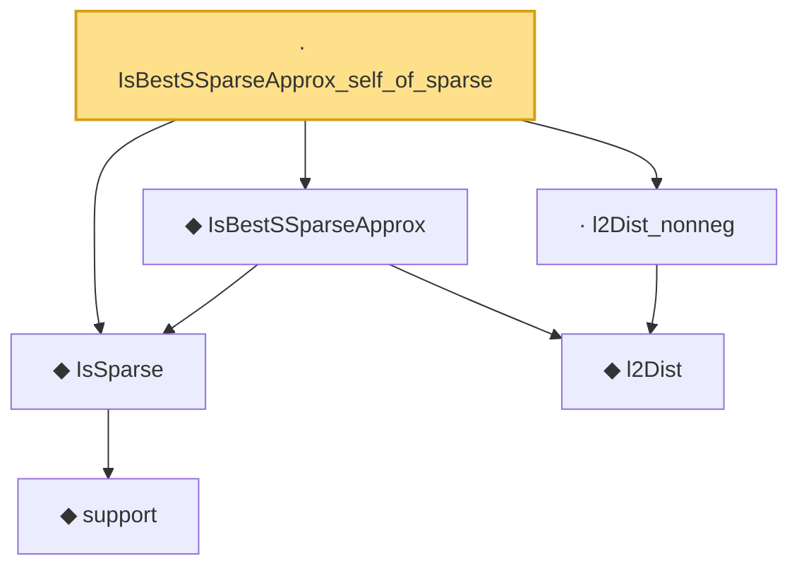

# Proof narrative — IsBestSSparseApprox_self_of_sparse

Root: **IsBestSSparseApprox_self_of_sparse** (lemma) `Statlib/CompressedSensing/IsBestSSparseApprox_self_of_sparse.lean:13` · topic `CompressedSensing`
Closure: 6 declarations across 5 files. Generated from `proof_graph.json` — no files were moved.

Reading order (foundations first, headline last):

    ◆ `support` — noncomputable def · `Statlib/HDStats/Basic.lean:51`  _(also used by 4: isSparse_iff_card_support, support_smul_subset, lasso_l2_error_on_support, …)_
  ◆ `IsSparse` — def · `Statlib/HDStats/Basic.lean:56`  _(also used by 13: IsIhtStep.isSparse, iht_recovery, IsSparse.zero, …)_
    ◆ `l2Dist` — def · `Statlib/CompressedSensing/l2Dist.lean:13`  _(also used by 1: IsBestSSparseApprox_zero)_
  ◆ `IsBestSSparseApprox` — def · `Statlib/CompressedSensing/IsBestSSparseApprox.lean:15`  _(also used by 2: IsBestSSparseApprox_zero, IsIhtStep)_
  · `l2Dist_nonneg` — lemma · `Statlib/CompressedSensing/l2Dist_nonneg.lean:10`  _(also used by 1: IsBestSSparseApprox_zero)_
· `IsBestSSparseApprox_self_of_sparse` — lemma · `Statlib/CompressedSensing/IsBestSSparseApprox_self_of_sparse.lean:13` **← headline**

## Dependency diagram

