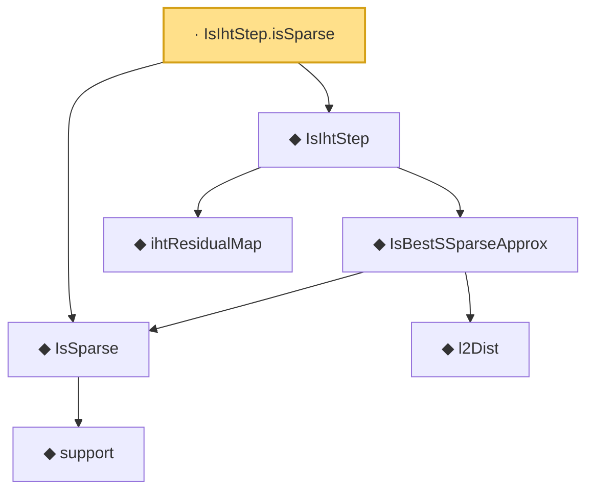

# Proof narrative — IsIhtStep.isSparse

Root: **IsIhtStep.isSparse** (lemma) `Statlib/CompressedSensing/IsIhtStep_isSparse.lean:11` · topic `CompressedSensing`
Closure: 7 declarations across 6 files. Generated from `proof_graph.json` — no files were moved.

Reading order (foundations first, headline last):

        ◆ `support` — noncomputable def · `Statlib/HDStats/Basic.lean:51`  _(also used by 4: isSparse_iff_card_support, support_smul_subset, lasso_l2_error_on_support, …)_
  ◆ `IsSparse` — def · `Statlib/HDStats/Basic.lean:56`  _(also used by 13: IsBestSSparseApprox_self_of_sparse, iht_recovery, IsSparse.zero, …)_
      ◆ `l2Dist` — def · `Statlib/CompressedSensing/l2Dist.lean:13`  _(also used by 2: IsBestSSparseApprox_zero, l2Dist_nonneg)_
    ◆ `IsBestSSparseApprox` — def · `Statlib/CompressedSensing/IsBestSSparseApprox.lean:15`  _(also used by 2: IsBestSSparseApprox_self_of_sparse, IsBestSSparseApprox_zero)_
    ◆ `ihtResidualMap` — def · `Statlib/CompressedSensing/ihtResidualMap.lean:14`  _(also used by 1: IsIhtStep.zero_of_zero)_
  ◆ `IsIhtStep` — def · `Statlib/CompressedSensing/IsIhtStep.lean:14`  _(also used by 1: IsIhtStep.zero_of_zero)_
· `IsIhtStep.isSparse` — lemma · `Statlib/CompressedSensing/IsIhtStep_isSparse.lean:11` **← headline**

## Dependency diagram

