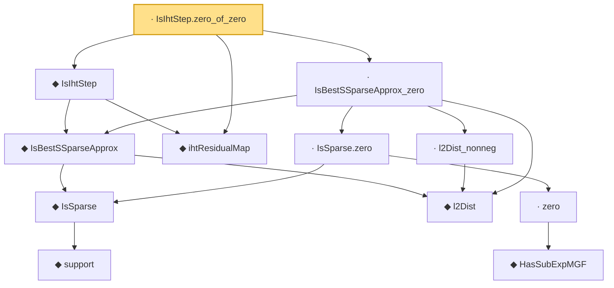

# Proof narrative — IsIhtStep.zero_of_zero

Root: **IsIhtStep.zero_of_zero** (lemma) `Statlib/CompressedSensing/IsIhtStep_zero_of_zero.lean:15` · topic `CompressedSensing`
Closure: 12 declarations across 10 files. Generated from `proof_graph.json` — no files were moved.

Reading order (foundations first, headline last):

        ◆ `support` — noncomputable def · `Statlib/HDStats/Basic.lean:51`  _(also used by 4: isSparse_iff_card_support, support_smul_subset, lasso_l2_error_on_support, …)_
      ◆ `IsSparse` — def · `Statlib/HDStats/Basic.lean:56`  _(also used by 13: IsBestSSparseApprox_self_of_sparse, IsIhtStep.isSparse, iht_recovery, …)_
    ◆ `l2Dist` — def · `Statlib/CompressedSensing/l2Dist.lean:13`
    ◆ `IsBestSSparseApprox` — def · `Statlib/CompressedSensing/IsBestSSparseApprox.lean:15`  _(also used by 1: IsBestSSparseApprox_self_of_sparse)_
  ◆ `ihtResidualMap` — def · `Statlib/CompressedSensing/ihtResidualMap.lean:14`
  ◆ `IsIhtStep` — def · `Statlib/CompressedSensing/IsIhtStep.lean:14`  _(also used by 1: IsIhtStep.isSparse)_
        ◆ `HasSubExpMGF` — def · `Statlib/HDStats/HasSubExpMGF.lean:16`  _(also used by 7: bernstein_tail, const_smul, integrable_exp_mul, …)_
      · `zero` — lemma · `Statlib/HDStats/zero.lean:12`
    · `IsSparse.zero` — lemma · `Statlib/HDStats/Basic.lean:62`
    · `l2Dist_nonneg` — lemma · `Statlib/CompressedSensing/l2Dist_nonneg.lean:10`  _(also used by 1: IsBestSSparseApprox_self_of_sparse)_
  · `IsBestSSparseApprox_zero` — lemma · `Statlib/CompressedSensing/IsBestSSparseApprox_zero.lean:14`
· `IsIhtStep.zero_of_zero` — lemma · `Statlib/CompressedSensing/IsIhtStep_zero_of_zero.lean:15` **← headline**

## Dependency diagram

