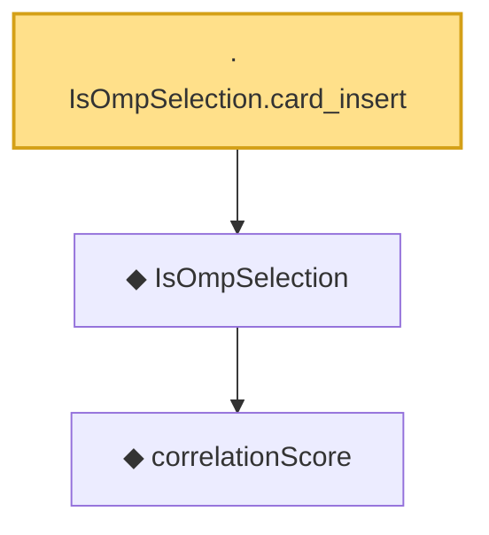

# Proof narrative — IsOmpSelection.card_insert

Root: **IsOmpSelection.card_insert** (lemma) `Statlib/CompressedSensing/IsOmpSelection_card_insert.lean:12` · topic `CompressedSensing`
Closure: 3 declarations across 3 files. Generated from `proof_graph.json` — no files were moved.

Reading order (foundations first, headline last):

    ◆ `correlationScore` — def · `Statlib/CompressedSensing/correlationScore.lean:11`  _(also used by 1: correlationScore_nonneg)_
  ◆ `IsOmpSelection` — def · `Statlib/CompressedSensing/IsOmpSelection.lean:12`  _(also used by 1: IsOmpSelection.not_mem)_
· `IsOmpSelection.card_insert` — lemma · `Statlib/CompressedSensing/IsOmpSelection_card_insert.lean:12` **← headline**

## Dependency diagram

