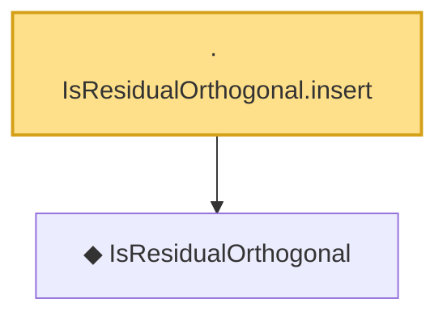

# Proof narrative — IsResidualOrthogonal.insert

Root: **IsResidualOrthogonal.insert** (lemma) `Statlib/CompressedSensing/IsResidualOrthogonal_insert.lean:12` · topic `CompressedSensing`
Closure: 2 declarations across 2 files. Generated from `proof_graph.json` — no files were moved.

Reading order (foundations first, headline last):

  ◆ `IsResidualOrthogonal` — def · `Statlib/CompressedSensing/IsResidualOrthogonal.lean:11`  _(also used by 1: IsResidualOrthogonal_zero)_
· `IsResidualOrthogonal.insert` — lemma · `Statlib/CompressedSensing/IsResidualOrthogonal_insert.lean:12` **← headline**

## Dependency diagram

