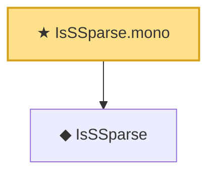

# Proof narrative — IsSSparse.mono

Root: **IsSSparse.mono** (theorem) `Statlib/CompressedSensing/IsSSparse_mono.lean:14` · topic `CompressedSensing`
Closure: 2 declarations across 2 files. Generated from `proof_graph.json` — no files were moved.

Reading order (foundations first, headline last):

  ◆ `IsSSparse` — def · `Statlib/CompressedSensing/IsSSparse.lean:11`  _(also used by 12: IsRIP, IsSSparse.add_disjoint, IsSSparse.neg, …)_
★ `IsSSparse.mono` — theorem · `Statlib/CompressedSensing/IsSSparse_mono.lean:14` **← headline**

## Dependency diagram

