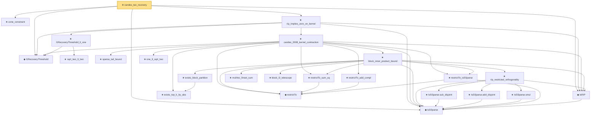

# Proof narrative — candes_tao_recovery

Root: **candes_tao_recovery** (theorem) `Statlib/CompressedSensing/candes_tao_recovery.lean:23` · topic `CompressedSensing`
Closure: 24 declarations across 24 files. Generated from `proof_graph.json` — no files were moved.

Reading order (foundations first, headline last):

  ◆ `l1RecoveryThreshold` — noncomputable def · `Statlib/CompressedSensing/l1RecoveryThreshold.lean:10`  _(also used by 2: l1RecoveryThreshold_mem_Ioo, l1RecoveryThreshold_pos)_
  ◆ `IsSSparse` — def · `Statlib/CompressedSensing/IsSSparse.lean:11`  _(also used by 3: IsSSparse.mono, IsSSparse.neg, zero_isSSparse)_
  ◆ `IsRIP` — def · `Statlib/CompressedSensing/IsRIP.lean:13`
  ★ `cone_constraint` — theorem · `Statlib/CompressedSensing/cone_constraint.lean:15`
      ★ `sqrt_two_lt_two` — theorem · `Statlib/CompressedSensing/sqrt_two_lt_two.lean:12`
    ★ `l1RecoveryThreshold_lt_one` — theorem · `Statlib/CompressedSensing/l1RecoveryThreshold_lt_one.lean:14`  _(also used by 1: l1RecoveryThreshold_mem_Ioo)_
      ★ `exists_top_k_by_abs` — theorem · `Statlib/CompressedSensing/exists_top_k_by_abs.lean:17`
      ◆ `restrictTo` — def · `Statlib/CompressedSensing/restrictTo.lean:15`  _(also used by 3: mulVec_restrictTo_add, restrictTo_disjoint_supports, restrictTo_sum_abs)_
      ★ `restrictTo_isSSparse` — theorem · `Statlib/CompressedSensing/restrictTo_isSSparse.lean:15`
      ★ `restrictTo_add_compl` — theorem · `Statlib/CompressedSensing/restrictTo_add_compl.lean:13`  _(also used by 1: mulVec_restrictTo_add)_
      ★ `restrictTo_sum_sq` — theorem · `Statlib/CompressedSensing/restrictTo_sum_sq.lean:13`
      ★ `sparse_tail_bound` — theorem · `Statlib/CompressedSensing/sparse_tail_bound.lean:15`
        ★ `exists_block_partition` — theorem · `Statlib/CompressedSensing/exists_block_partition.lean:55`
          ★ `IsSSparse.smul` — theorem · `Statlib/CompressedSensing/IsSSparse_smul.lean:14`
          ★ `IsSSparse.add_disjoint` — theorem · `Statlib/CompressedSensing/IsSSparse_add_disjoint.lean:15`
          ★ `IsSSparse.sub_disjoint` — theorem · `Statlib/CompressedSensing/IsSSparse_sub_disjoint.lean:14`
        ★ `rip_restricted_orthogonality` — theorem · `Statlib/CompressedSensing/rip_restricted_orthogonality.lean:20`
        ★ `mulVec_finset_sum` — theorem · `Statlib/CompressedSensing/mulVec_finset_sum.lean:14`
        ★ `block_l2_telescope` — theorem · `Statlib/CompressedSensing/block_l2_telescope.lean:40`
      ★ `block_inner_product_bound` — theorem · `Statlib/CompressedSensing/block_inner_product_bound.lean:67`
      ★ `one_lt_sqrt_two` — theorem · `Statlib/CompressedSensing/one_lt_sqrt_two.lean:12`  _(also used by 1: l1RecoveryThreshold_pos)_
    ★ `candes_2008_kernel_contraction` — theorem · `Statlib/CompressedSensing/candes_2008_kernel_contraction.lean:39`
  ★ `rip_implies_zero_on_kernel` — theorem · `Statlib/CompressedSensing/rip_implies_zero_on_kernel.lean:26`
★ `candes_tao_recovery` — theorem · `Statlib/CompressedSensing/candes_tao_recovery.lean:23` **← headline**

## Dependency diagram

