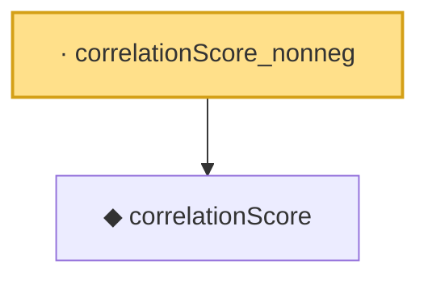

# Proof narrative — correlationScore_nonneg

Root: **correlationScore_nonneg** (lemma) `Statlib/CompressedSensing/correlationScore_nonneg.lean:11` · topic `CompressedSensing`
Closure: 2 declarations across 2 files. Generated from `proof_graph.json` — no files were moved.

Reading order (foundations first, headline last):

  ◆ `correlationScore` — def · `Statlib/CompressedSensing/correlationScore.lean:11`  _(also used by 1: IsOmpSelection)_
· `correlationScore_nonneg` — lemma · `Statlib/CompressedSensing/correlationScore_nonneg.lean:11` **← headline**

## Dependency diagram

