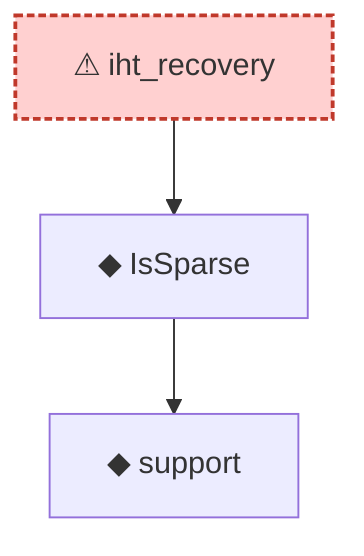

# Proof narrative — iht_recovery

Root: **iht_recovery** (axiom) `Statlib/CompressedSensing/iht_recovery.lean:18` · topic `CompressedSensing`
Closure: 3 declarations across 2 files. Generated from `proof_graph.json` — no files were moved.

Reading order (foundations first, headline last):

    ◆ `support` — noncomputable def · `Statlib/HDStats/Basic.lean:51`  _(also used by 4: isSparse_iff_card_support, support_smul_subset, lasso_l2_error_on_support, …)_
  ◆ `IsSparse` — def · `Statlib/HDStats/Basic.lean:56`  _(also used by 14: IsBestSSparseApprox, IsBestSSparseApprox_self_of_sparse, IsIhtStep.isSparse, …)_
⚠ `iht_recovery` — axiom · `Statlib/CompressedSensing/iht_recovery.lean:18` **← headline**

## Dependency diagram

> ⚠ `iht_recovery` is an **axiom** (no proof body), so its closure only covers declarations referenced in its *statement*. Supporting lemmas in `CompressedSensing/` that were meant to prove it are not edge-connected — a signal that the proof line was atomised then axiomatised apart.
