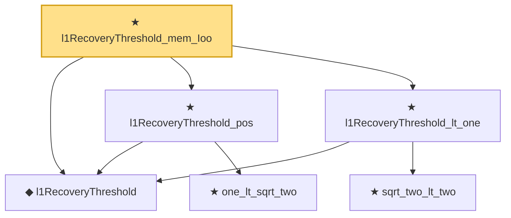

# Proof narrative — l1RecoveryThreshold_mem_Ioo

Root: **l1RecoveryThreshold_mem_Ioo** (theorem) `Statlib/CompressedSensing/l1RecoveryThreshold_mem_Ioo.lean:15` · topic `CompressedSensing`
Closure: 6 declarations across 6 files. Generated from `proof_graph.json` — no files were moved.

Reading order (foundations first, headline last):

  ◆ `l1RecoveryThreshold` — noncomputable def · `Statlib/CompressedSensing/l1RecoveryThreshold.lean:10`  _(also used by 3: candes_2008_kernel_contraction, candes_tao_recovery, rip_implies_zero_on_kernel)_
    ★ `one_lt_sqrt_two` — theorem · `Statlib/CompressedSensing/one_lt_sqrt_two.lean:12`  _(also used by 1: candes_2008_kernel_contraction)_
  ★ `l1RecoveryThreshold_pos` — theorem · `Statlib/CompressedSensing/l1RecoveryThreshold_pos.lean:14`
    ★ `sqrt_two_lt_two` — theorem · `Statlib/CompressedSensing/sqrt_two_lt_two.lean:12`
  ★ `l1RecoveryThreshold_lt_one` — theorem · `Statlib/CompressedSensing/l1RecoveryThreshold_lt_one.lean:14`  _(also used by 1: rip_implies_zero_on_kernel)_
★ `l1RecoveryThreshold_mem_Ioo` — theorem · `Statlib/CompressedSensing/l1RecoveryThreshold_mem_Ioo.lean:15` **← headline**

## Dependency diagram

