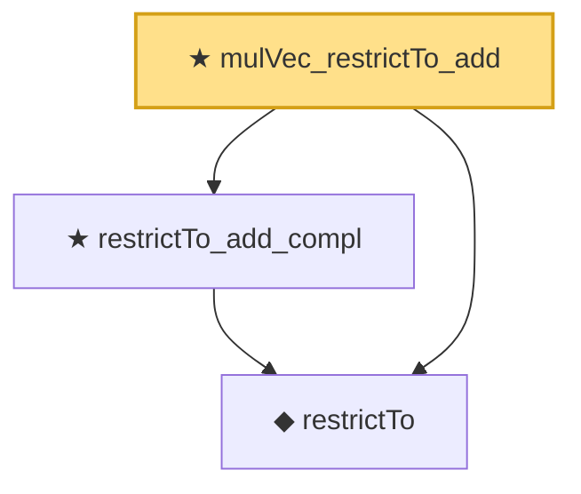

# Proof narrative — mulVec_restrictTo_add

Root: **mulVec_restrictTo_add** (theorem) `Statlib/CompressedSensing/mulVec_restrictTo_add.lean:14` · topic `CompressedSensing`
Closure: 3 declarations across 3 files. Generated from `proof_graph.json` — no files were moved.

Reading order (foundations first, headline last):

  ◆ `restrictTo` — def · `Statlib/CompressedSensing/restrictTo.lean:15`  _(also used by 6: block_inner_product_bound, candes_2008_kernel_contraction, restrictTo_disjoint_supports, …)_
  ★ `restrictTo_add_compl` — theorem · `Statlib/CompressedSensing/restrictTo_add_compl.lean:13`  _(also used by 1: candes_2008_kernel_contraction)_
★ `mulVec_restrictTo_add` — theorem · `Statlib/CompressedSensing/mulVec_restrictTo_add.lean:14` **← headline**

## Dependency diagram

