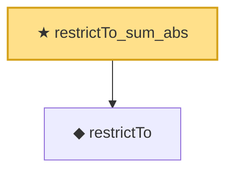

# Proof narrative — restrictTo_sum_abs

Root: **restrictTo_sum_abs** (theorem) `Statlib/CompressedSensing/restrictTo_sum_abs.lean:13` · topic `CompressedSensing`
Closure: 2 declarations across 2 files. Generated from `proof_graph.json` — no files were moved.

Reading order (foundations first, headline last):

  ◆ `restrictTo` — def · `Statlib/CompressedSensing/restrictTo.lean:15`  _(also used by 7: block_inner_product_bound, candes_2008_kernel_contraction, mulVec_restrictTo_add, …)_
★ `restrictTo_sum_abs` — theorem · `Statlib/CompressedSensing/restrictTo_sum_abs.lean:13` **← headline**

## Dependency diagram

