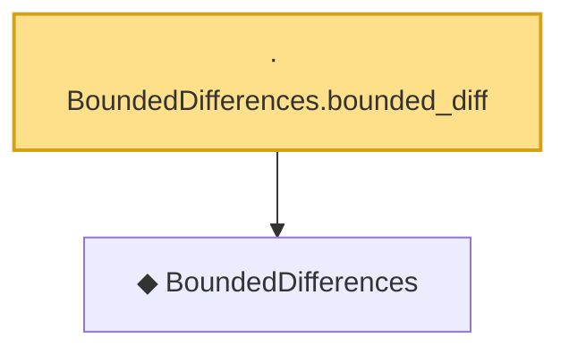

# Proof narrative — BoundedDifferences.bounded_diff

Root: **BoundedDifferences.bounded_diff** (lemma) `Statlib/Concentration/BoundedDifferences_bounded_diff.lean:27` · topic `Concentration`
Closure: 2 declarations across 2 files. Generated from `proof_graph.json` — no files were moved.

Reading order (foundations first, headline last):

  ◆ `BoundedDifferences` — def · `Statlib/Concentration/BoundedDifferences.lean:22`  _(also used by 4: BoundedDifferences.neg, mcdiarmid, mcdiarmid_mgf_bound, …)_
· `BoundedDifferences.bounded_diff` — lemma · `Statlib/Concentration/BoundedDifferences_bounded_diff.lean:27` **← headline**

## Dependency diagram

