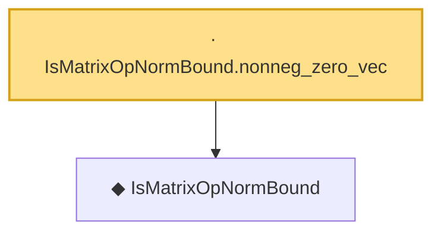

# Proof narrative — IsMatrixOpNormBound.nonneg_zero_vec

Root: **IsMatrixOpNormBound.nonneg_zero_vec** (lemma) `Statlib/Concentration/IsMatrixOpNormBound_nonneg_zero_vec.lean:13` · topic `Concentration`
Closure: 2 declarations across 2 files. Generated from `proof_graph.json` — no files were moved.

Reading order (foundations first, headline last):

  ◆ `IsMatrixOpNormBound` — def · `Statlib/Concentration/IsMatrixOpNormBound.lean:14`  _(also used by 1: hanson_wright_inequality)_
· `IsMatrixOpNormBound.nonneg_zero_vec` — lemma · `Statlib/Concentration/IsMatrixOpNormBound_nonneg_zero_vec.lean:13` **← headline**

## Dependency diagram

