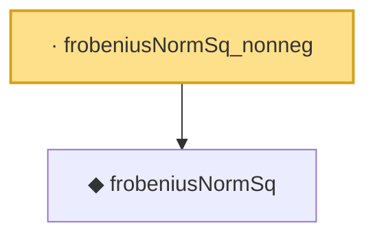

# Proof narrative — frobeniusNormSq_nonneg

Root: **frobeniusNormSq_nonneg** (lemma) `Statlib/Concentration/frobeniusNormSq_nonneg.lean:13` · topic `Concentration`
Closure: 2 declarations across 2 files. Generated from `proof_graph.json` — no files were moved.

Reading order (foundations first, headline last):

  ◆ `frobeniusNormSq` — def · `Statlib/Concentration/frobeniusNormSq.lean:15`  _(also used by 2: frobeniusNormSq_transpose, hanson_wright_inequality)_
· `frobeniusNormSq_nonneg` — lemma · `Statlib/Concentration/frobeniusNormSq_nonneg.lean:13` **← headline**

## Dependency diagram

