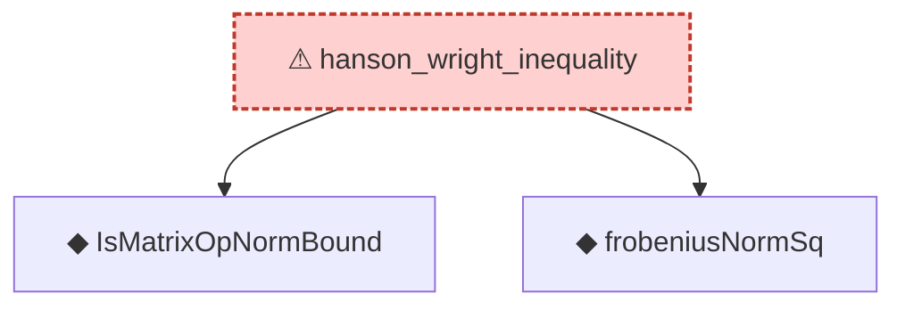

# Proof narrative — hanson_wright_inequality

Root: **hanson_wright_inequality** (axiom) `Statlib/Concentration/hanson_wright_inequality.lean:45` · topic `Concentration`
Closure: 3 declarations across 3 files. Generated from `proof_graph.json` — no files were moved.

Reading order (foundations first, headline last):

  ◆ `IsMatrixOpNormBound` — def · `Statlib/Concentration/IsMatrixOpNormBound.lean:14`  _(also used by 1: IsMatrixOpNormBound.nonneg_zero_vec)_
  ◆ `frobeniusNormSq` — def · `Statlib/Concentration/frobeniusNormSq.lean:15`  _(also used by 2: frobeniusNormSq_nonneg, frobeniusNormSq_transpose)_
⚠ `hanson_wright_inequality` — axiom · `Statlib/Concentration/hanson_wright_inequality.lean:45` **← headline**

## Dependency diagram

> ⚠ `hanson_wright_inequality` is an **axiom** (no proof body), so its closure only covers declarations referenced in its *statement*. Supporting lemmas in `Concentration/` that were meant to prove it are not edge-connected — a signal that the proof line was atomised then axiomatised apart.
