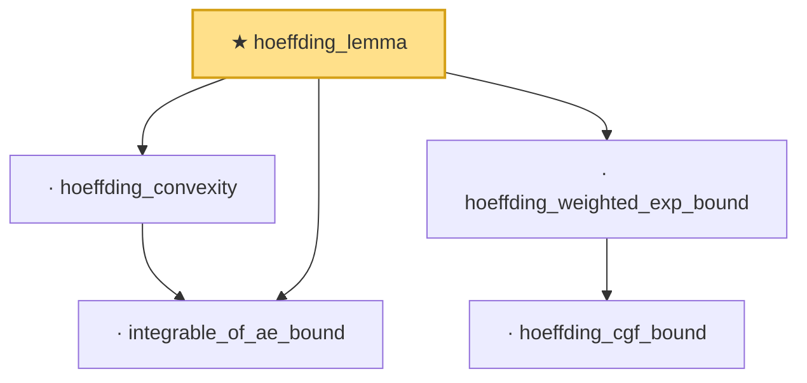

# Proof narrative — hoeffding_lemma

Root: **hoeffding_lemma** (theorem) `Statlib/Concentration/hoeffding_lemma.lean:29` · topic `Concentration`
Closure: 5 declarations across 5 files. Generated from `proof_graph.json` — no files were moved.

Reading order (foundations first, headline last):

  · `integrable_of_ae_bound` — lemma · `Statlib/Concentration/integrable_of_ae_bound.lean:18`
  · `hoeffding_convexity` — lemma · `Statlib/Concentration/hoeffding_convexity.lean:23`
    · `hoeffding_cgf_bound` — lemma · `Statlib/Concentration/hoeffding_cgf_bound.lean:23`
  · `hoeffding_weighted_exp_bound` — lemma · `Statlib/Concentration/hoeffding_weighted_exp_bound.lean:23`
★ `hoeffding_lemma` — theorem · `Statlib/Concentration/hoeffding_lemma.lean:29` **← headline**

## Dependency diagram

