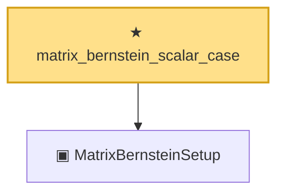

# Proof narrative — matrix_bernstein_scalar_case

Root: **matrix_bernstein_scalar_case** (theorem) `Statlib/Concentration/matrix_bernstein_scalar_case.lean:20` · topic `Concentration`
Closure: 2 declarations across 2 files. Generated from `proof_graph.json` — no files were moved.

Reading order (foundations first, headline last):

  ▣ `MatrixBernsteinSetup` — structure · `Statlib/Concentration/MatrixBernsteinSetup.lean:15`  _(also used by 1: matrix_bernstein_tropp)_
★ `matrix_bernstein_scalar_case` — theorem · `Statlib/Concentration/matrix_bernstein_scalar_case.lean:20` **← headline**

## Dependency diagram

