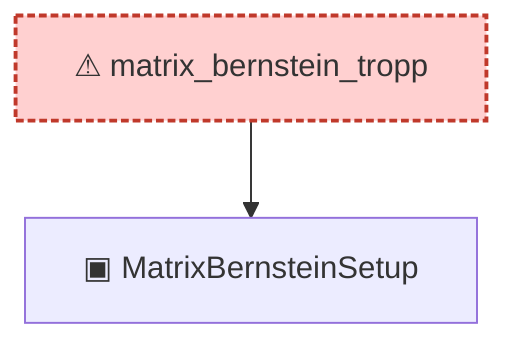

# Proof narrative — matrix_bernstein_tropp

Root: **matrix_bernstein_tropp** (axiom) `Statlib/Concentration/matrix_bernstein_tropp.lean:31` · topic `Concentration`
Closure: 2 declarations across 2 files. Generated from `proof_graph.json` — no files were moved.

Reading order (foundations first, headline last):

  ▣ `MatrixBernsteinSetup` — structure · `Statlib/Concentration/MatrixBernsteinSetup.lean:15`  _(also used by 1: matrix_bernstein_scalar_case)_
⚠ `matrix_bernstein_tropp` — axiom · `Statlib/Concentration/matrix_bernstein_tropp.lean:31` **← headline**

## Dependency diagram

> ⚠ `matrix_bernstein_tropp` is an **axiom** (no proof body), so its closure only covers declarations referenced in its *statement*. Supporting lemmas in `Concentration/` that were meant to prove it are not edge-connected — a signal that the proof line was atomised then axiomatised apart.
