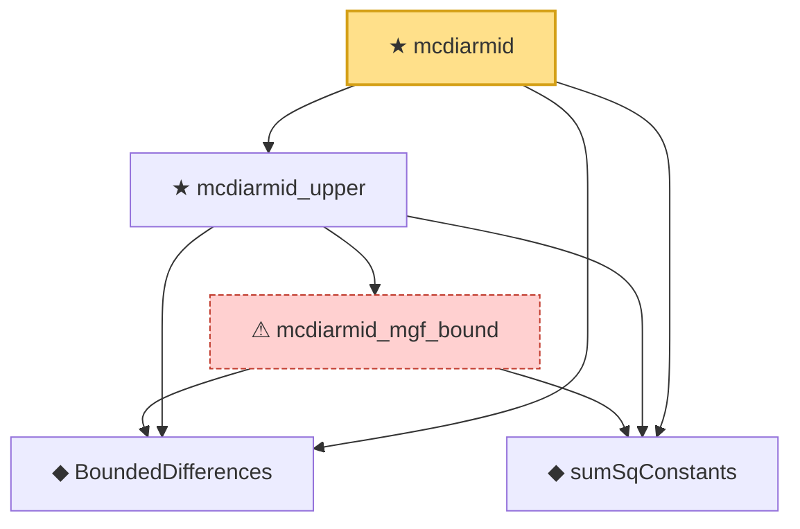

# Proof narrative — mcdiarmid

Root: **mcdiarmid** (theorem) `Statlib/Concentration/mcdiarmid.lean:25` · topic `Concentration`
Closure: 5 declarations across 5 files. Generated from `proof_graph.json` — no files were moved.

Reading order (foundations first, headline last):

  ◆ `BoundedDifferences` — def · `Statlib/Concentration/BoundedDifferences.lean:22`  _(also used by 2: BoundedDifferences.bounded_diff, BoundedDifferences.neg)_
  ◆ `sumSqConstants` — noncomputable def · `Statlib/Concentration/sumSqConstants.lean:18`  _(also used by 1: mcdiarmid_mgf_bound_empty)_
    ⚠ `mcdiarmid_mgf_bound` — axiom · `Statlib/Concentration/mcdiarmid_mgf_bound.lean:31`
  ★ `mcdiarmid_upper` — theorem · `Statlib/Concentration/mcdiarmid_upper.lean:29`
★ `mcdiarmid` — theorem · `Statlib/Concentration/mcdiarmid.lean:25` **← headline**

## Dependency diagram

