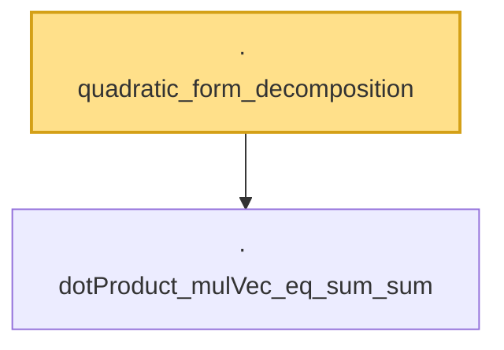

# Proof narrative — quadratic_form_decomposition

Root: **quadratic_form_decomposition** (lemma) `Statlib/Concentration/quadratic_form_decomposition.lean:15` · topic `Concentration`
Closure: 2 declarations across 2 files. Generated from `proof_graph.json` — no files were moved.

Reading order (foundations first, headline last):

  · `dotProduct_mulVec_eq_sum_sum` — lemma · `Statlib/Concentration/dotProduct_mulVec_eq_sum_sum.lean:16`
· `quadratic_form_decomposition` — lemma · `Statlib/Concentration/quadratic_form_decomposition.lean:15` **← headline**

## Dependency diagram

