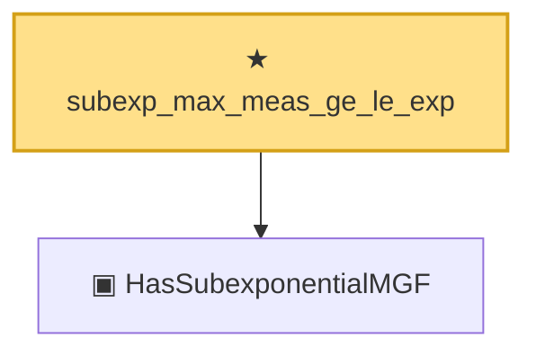

# Proof narrative — subexp_max_meas_ge_le_exp

Root: **subexp_max_meas_ge_le_exp** (theorem) `Statlib/Concentration/subexp_max_meas_ge_le_exp.lean:8` · topic `Concentration`
Closure: 2 declarations across 2 files. Generated from `proof_graph.json` — no files were moved.

Reading order (foundations first, headline last):

  ▣ `HasSubexponentialMGF` — structure · `Statlib/Vocabulary/RandomVariable.lean:74`  _(also used by 10: bernstein_sum_meas_abs_ge_le_two_exp, bernstein_sum_meas_ge_le_exp, subexp_mean_meas_ge_le_exp, …)_
★ `subexp_max_meas_ge_le_exp` — theorem · `Statlib/Concentration/subexp_max_meas_ge_le_exp.lean:8` **← headline**

## Dependency diagram

