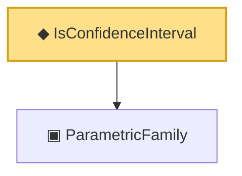

# Proof narrative — IsConfidenceInterval

Root: **IsConfidenceInterval** (def) `Statlib/Confidence/IsConfidenceInterval.lean:12` · topic `Confidence`
Closure: 2 declarations across 2 files. Generated from `proof_graph.json` — no files were moved.

Reading order (foundations first, headline last):

  ▣ `ParametricFamily` — structure · `Statlib/Statistic/Basic.lean:64`  _(also used by 46: CoverageProb, IsConfidenceSet, IsPivot, …)_
◆ `IsConfidenceInterval` — def · `Statlib/Confidence/IsConfidenceInterval.lean:12` **← headline**

## Dependency diagram

