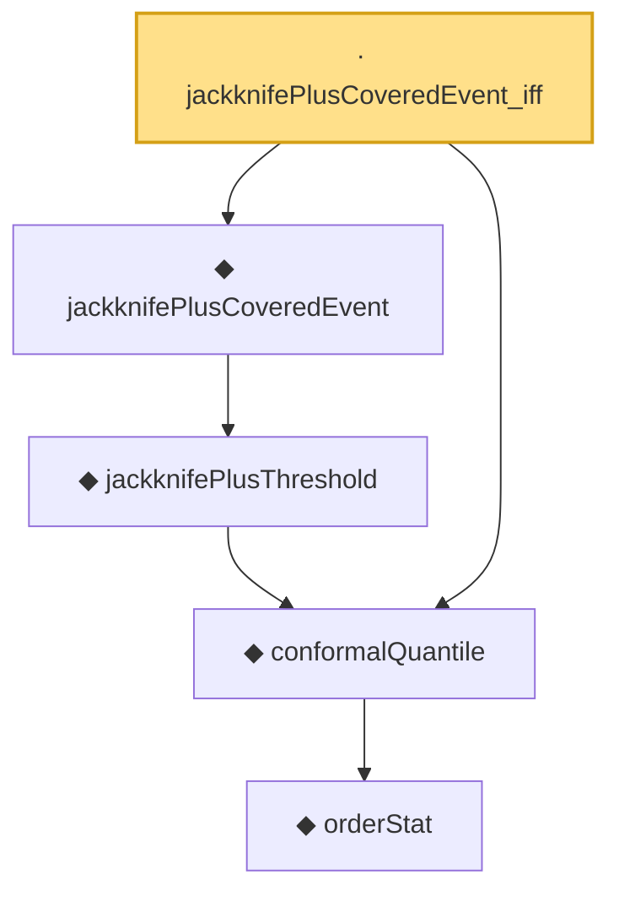

# Proof narrative — jackknifePlusCoveredEvent_iff

Root: **jackknifePlusCoveredEvent_iff** (lemma) `Statlib/Conformal/jackknifePlusCoveredEvent_iff.lean:12` · topic `Conformal`
Closure: 5 declarations across 4 files. Generated from `proof_graph.json` — no files were moved.

Reading order (foundations first, headline last):

        ◆ `orderStat` — noncomputable def · `Statlib/Conformal/Basic.lean:65`  _(also used by 1: coverage_event_iff_rank_le)_
  ◆ `conformalQuantile` — noncomputable def · `Statlib/Conformal/Basic.lean:78`  _(also used by 8: coverage_event_iff_rank_le, jackknifePlusThreshold_eq_quantile, marginal_coverage, …)_
    ◆ `jackknifePlusThreshold` — noncomputable def · `Statlib/Conformal/jackknifePlusThreshold.lean:18`  _(also used by 1: jackknifePlusThreshold_eq_quantile)_
  ◆ `jackknifePlusCoveredEvent` — def · `Statlib/Conformal/jackknifePlusCoveredEvent.lean:14`  _(also used by 1: jackknifePlus_coverage)_
· `jackknifePlusCoveredEvent_iff` — lemma · `Statlib/Conformal/jackknifePlusCoveredEvent_iff.lean:12` **← headline**

## Dependency diagram

