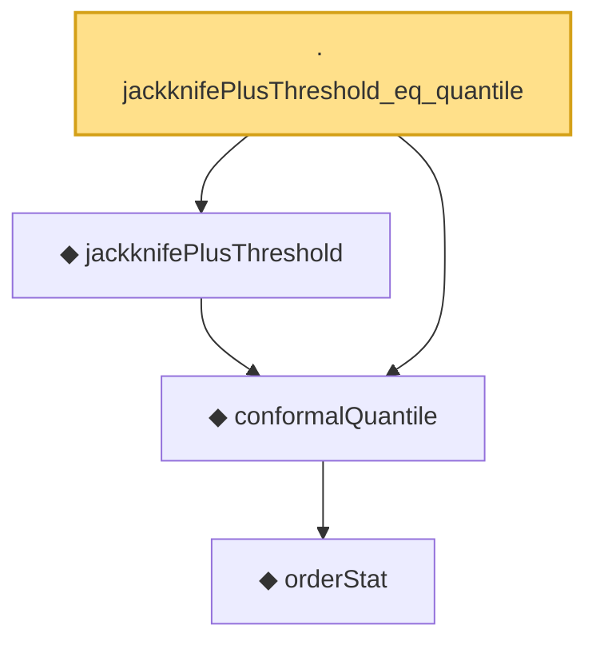

# Proof narrative — jackknifePlusThreshold_eq_quantile

Root: **jackknifePlusThreshold_eq_quantile** (lemma) `Statlib/Conformal/jackknifePlusThreshold_eq_quantile.lean:13` · topic `Conformal`
Closure: 4 declarations across 3 files. Generated from `proof_graph.json` — no files were moved.

Reading order (foundations first, headline last):

      ◆ `orderStat` — noncomputable def · `Statlib/Conformal/Basic.lean:65`  _(also used by 1: coverage_event_iff_rank_le)_
  ◆ `conformalQuantile` — noncomputable def · `Statlib/Conformal/Basic.lean:78`  _(also used by 8: coverage_event_iff_rank_le, jackknifePlusCoveredEvent_iff, marginal_coverage, …)_
  ◆ `jackknifePlusThreshold` — noncomputable def · `Statlib/Conformal/jackknifePlusThreshold.lean:18`  _(also used by 1: jackknifePlusCoveredEvent)_
· `jackknifePlusThreshold_eq_quantile` — lemma · `Statlib/Conformal/jackknifePlusThreshold_eq_quantile.lean:13` **← headline**

## Dependency diagram

