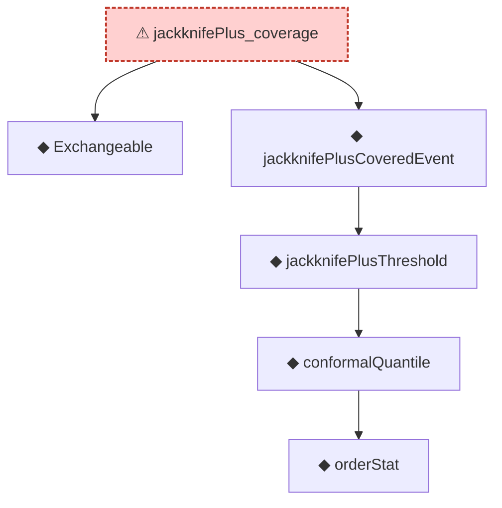

# Proof narrative — jackknifePlus_coverage

Root: **jackknifePlus_coverage** (axiom) `Statlib/Conformal/jackknifePlus_coverage.lean:40` · topic `Conformal`
Closure: 6 declarations across 4 files. Generated from `proof_graph.json` — no files were moved.

Reading order (foundations first, headline last):

  ◆ `Exchangeable` — def · `Statlib/Conformal/Basic.lean:53`  _(also used by 7: marginal_coverage, marginal_coverage_upper, measure_rankOf_eq_measure_rankOfLast, …)_
        ◆ `orderStat` — noncomputable def · `Statlib/Conformal/Basic.lean:65`  _(also used by 1: coverage_event_iff_rank_le)_
      ◆ `conformalQuantile` — noncomputable def · `Statlib/Conformal/Basic.lean:78`  _(also used by 9: coverage_event_iff_rank_le, jackknifePlusCoveredEvent_iff, jackknifePlusThreshold_eq_quantile, …)_
    ◆ `jackknifePlusThreshold` — noncomputable def · `Statlib/Conformal/jackknifePlusThreshold.lean:18`  _(also used by 1: jackknifePlusThreshold_eq_quantile)_
  ◆ `jackknifePlusCoveredEvent` — def · `Statlib/Conformal/jackknifePlusCoveredEvent.lean:14`  _(also used by 1: jackknifePlusCoveredEvent_iff)_
⚠ `jackknifePlus_coverage` — axiom · `Statlib/Conformal/jackknifePlus_coverage.lean:40` **← headline**

## Dependency diagram

> ⚠ `jackknifePlus_coverage` is an **axiom** (no proof body), so its closure only covers declarations referenced in its *statement*. Supporting lemmas in `Conformal/` that were meant to prove it are not edge-connected — a signal that the proof line was atomised then axiomatised apart.
