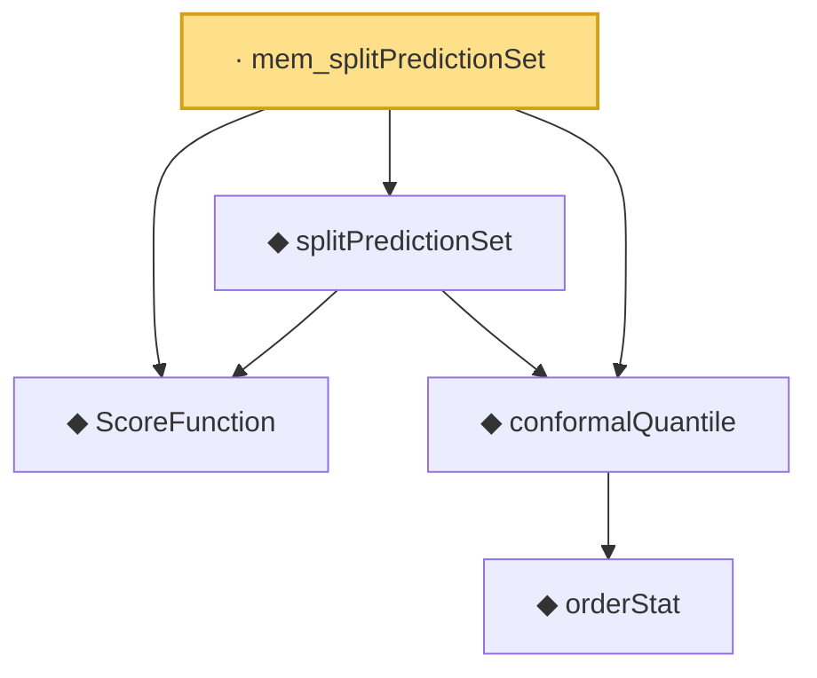

# Proof narrative — mem_splitPredictionSet

Root: **mem_splitPredictionSet** (lemma) `Statlib/Conformal/mem_splitPredictionSet.lean:14` · topic `Conformal`
Closure: 5 declarations across 4 files. Generated from `proof_graph.json` — no files were moved.

Reading order (foundations first, headline last):

  ◆ `ScoreFunction` — abbrev · `Statlib/Conformal/ScoreFunction.lean:12`
      ◆ `orderStat` — noncomputable def · `Statlib/Conformal/Basic.lean:65`  _(also used by 1: coverage_event_iff_rank_le)_
  ◆ `conformalQuantile` — noncomputable def · `Statlib/Conformal/Basic.lean:78`  _(also used by 8: coverage_event_iff_rank_le, jackknifePlusCoveredEvent_iff, jackknifePlusThreshold, …)_
  ◆ `splitPredictionSet` — def · `Statlib/Conformal/splitPredictionSet.lean:14`
· `mem_splitPredictionSet` — lemma · `Statlib/Conformal/mem_splitPredictionSet.lean:14` **← headline**

## Dependency diagram

