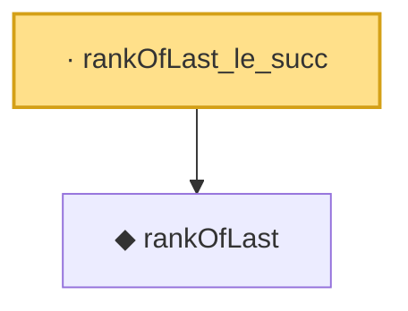

# Proof narrative — rankOfLast_le_succ

Root: **rankOfLast_le_succ** (lemma) `Statlib/Conformal/rankOfLast_le_succ.lean:10` · topic `Conformal`
Closure: 2 declarations across 2 files. Generated from `proof_graph.json` — no files were moved.

Reading order (foundations first, headline last):

  ◆ `rankOfLast` — noncomputable def · `Statlib/Conformal/rankOfLast.lean:13`  _(also used by 14: coverage_event_iff_rank_le, marginal_coverage, marginal_coverage_upper, …)_
· `rankOfLast_le_succ` — lemma · `Statlib/Conformal/rankOfLast_le_succ.lean:10` **← headline**

## Dependency diagram

