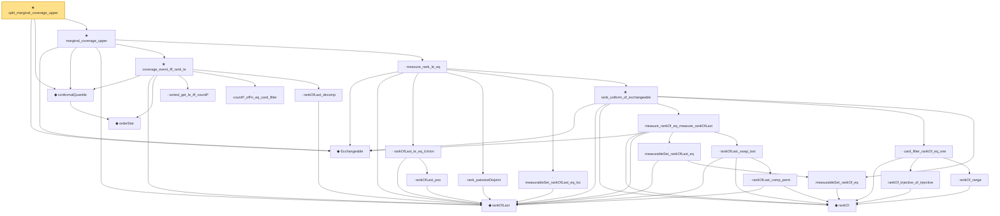

# Proof narrative — split_marginal_coverage_upper

Root: **split_marginal_coverage_upper** (theorem) `Statlib/Conformal/split_marginal_coverage_upper.lean:16` · topic `Conformal`
Closure: 25 declarations across 23 files. Generated from `proof_graph.json` — no files were moved.

Reading order (foundations first, headline last):

  ◆ `Exchangeable` — def · `Statlib/Conformal/Basic.lean:53`  _(also used by 3: jackknifePlus_coverage, marginal_coverage, split_marginal_coverage)_
    ◆ `orderStat` — noncomputable def · `Statlib/Conformal/Basic.lean:65`
  ◆ `conformalQuantile` — noncomputable def · `Statlib/Conformal/Basic.lean:78`  _(also used by 7: jackknifePlusCoveredEvent_iff, jackknifePlusThreshold, jackknifePlusThreshold_eq_quantile, …)_
    ◆ `rankOfLast` — noncomputable def · `Statlib/Conformal/rankOfLast.lean:13`  _(also used by 2: marginal_coverage, rankOfLast_le_succ)_
      · `sorted_get_le_iff_countP` — lemma · `Statlib/Conformal/sorted_get_le_iff_countP.lean:13`
      · `countP_ofFn_eq_card_filter` — lemma · `Statlib/Conformal/countP_ofFn_eq_card_filter.lean:13`
      · `rankOfLast_decomp` — lemma · `Statlib/Conformal/rankOfLast_decomp.lean:12`
    ★ `coverage_event_iff_rank_le` — theorem · `Statlib/Conformal/coverage_event_iff_rank_le.lean:27`  _(also used by 1: marginal_coverage)_
        · `rankOfLast_pos` — lemma · `Statlib/Conformal/rankOfLast_pos.lean:13`
      · `rankOfLast_le_eq_iUnion` — lemma · `Statlib/Conformal/rankOfLast_le_eq_iUnion.lean:12`
      · `rank_pairwiseDisjoint` — lemma · `Statlib/Conformal/rank_pairwiseDisjoint.lean:10`
      · `measurableSet_rankOfLast_eq_loc` — lemma · `Statlib/Conformal/measurableSet_rankOfLast_eq_loc.lean:13`
        ◆ `rankOf` — noncomputable def · `Statlib/Conformal/rankOf.lean:18`
        · `measurableSet_rankOf_eq` — lemma · `Statlib/Conformal/measurableSet_rankOf_eq.lean:11`
          · `measurableSet_rankOfLast_eq` — lemma · `Statlib/Conformal/measurableSet_rankOfLast_eq.lean:11`
            · `rankOfLast_comp_perm` — lemma · `Statlib/Conformal/rankOfLast_comp_perm.lean:13`
          · `rankOfLast_swap_last` — lemma · `Statlib/Conformal/rankOfLast_swap_last.lean:13`
        · `measure_rankOf_eq_measure_rankOfLast` — lemma · `Statlib/Conformal/measure_rankOf_eq_measure_rankOfLast.lean:15`
          · `rankOf_injective_of_injective` — lemma · `Statlib/Conformal/rankOf_injective_of_injective.lean:12`
          · `rankOf_range` — lemma · `Statlib/Conformal/rankOf_range.lean:11`
        · `card_filter_rankOf_eq_one` — lemma · `Statlib/Conformal/card_filter_rankOf_eq_one.lean:14`
      ★ `rank_uniform_of_exchangeable` — theorem · `Statlib/Conformal/rank_uniform_of_exchangeable.lean:32`
    · `measure_rank_le_eq` — lemma · `Statlib/Conformal/measure_rank_le_eq.lean:16`  _(also used by 1: marginal_coverage)_
  ★ `marginal_coverage_upper` — theorem · `Statlib/Conformal/marginal_coverage_upper.lean:18`
★ `split_marginal_coverage_upper` — theorem · `Statlib/Conformal/split_marginal_coverage_upper.lean:16` **← headline**

## Dependency diagram

