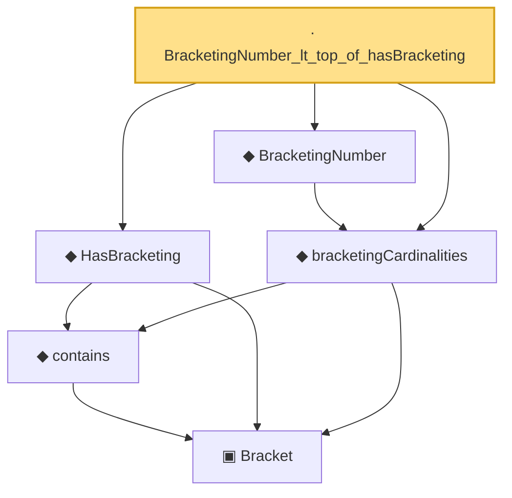

# Proof narrative — BracketingNumber_lt_top_of_hasBracketing

Root: **BracketingNumber_lt_top_of_hasBracketing** (lemma) `Statlib/CoxChangePoint/BracketingEntropy.lean:130` · topic `CoxChangePoint`
Closure: 6 declarations across 1 files. Generated from `proof_graph.json` — no files were moved.

Reading order (foundations first, headline last):

    ▣ `Bracket` — structure · `Statlib/CoxChangePoint/BracketingEntropy.lean:58`  _(also used by 2: lower_le_of_contains, le_upper_of_contains)_
    ◆ `contains` — def · `Statlib/CoxChangePoint/BracketingEntropy.lean:79`  _(also used by 2: lower_le_of_contains, le_upper_of_contains)_
  ◆ `HasBracketing` — def · `Statlib/CoxChangePoint/BracketingEntropy.lean:102`  _(also used by 2: hasBracketing_of_bracketingNumber_lt_top, coveringLeBracketing_trivial_of_no_bracketing)_
  ◆ `bracketingCardinalities` — def · `Statlib/CoxChangePoint/BracketingEntropy.lean:111`  _(also used by 2: hasBracketing_of_bracketingNumber_lt_top, coveringLeBracketing_trivial_of_no_bracketing)_
  ◆ `BracketingNumber` — noncomputable def · `Statlib/CoxChangePoint/BracketingEntropy.lean:120`  _(also used by 6: hasBracketing_of_bracketingNumber_lt_top, bracketingEntropy, vw_2_14_9_statement, …)_
· `BracketingNumber_lt_top_of_hasBracketing` — lemma · `Statlib/CoxChangePoint/BracketingEntropy.lean:130` **← headline**

## Dependency diagram

