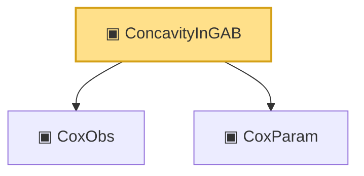

# Proof narrative — ConcavityInGAB

Root: **ConcavityInGAB** (structure) `Statlib/CoxChangePoint/PopulationObjectiveConcrete.lean:185` · topic `CoxChangePoint`
Closure: 3 declarations across 2 files. Generated from `proof_graph.json` — no files were moved.

Reading order (foundations first, headline last):

  ▣ `CoxObs` — structure · `Statlib/CoxChangePoint/Foundation.lean:38`  _(also used by 42: TruncSample, benchmark_obs, coxScoreAt, …)_
  ▣ `CoxParam` — structure · `Statlib/CoxChangePoint/Foundation.lean:57`  _(also used by 72: liftAuto, concreteGn, buildLemmaS1Data, …)_
▣ `ConcavityInGAB` — structure · `Statlib/CoxChangePoint/PopulationObjectiveConcrete.lean:185` **← headline**

## Dependency diagram

