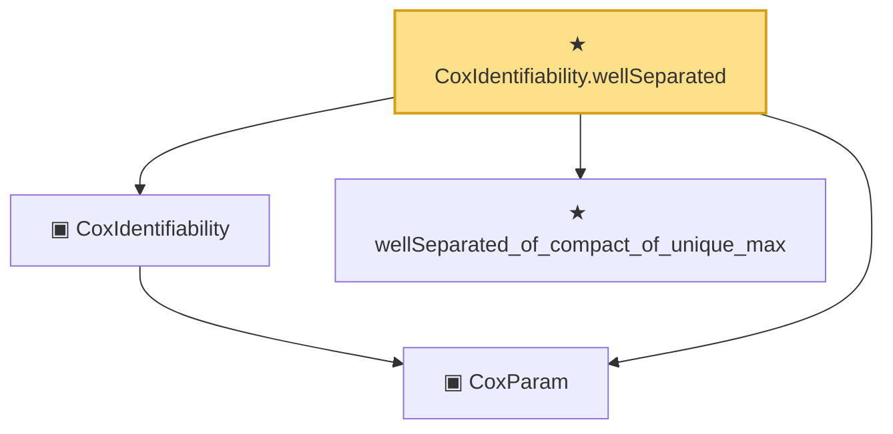

# Proof narrative — CoxIdentifiability.wellSeparated

Root: **CoxIdentifiability.wellSeparated** (theorem) `Statlib/CoxChangePoint/PopulationObjectiveConcrete.lean:236` · topic `CoxChangePoint`
Closure: 4 declarations across 3 files. Generated from `proof_graph.json` — no files were moved.

Reading order (foundations first, headline last):

  ▣ `CoxParam` — structure · `Statlib/CoxChangePoint/Foundation.lean:57`  _(also used by 71: liftAuto, concreteGn, buildLemmaS1Data, …)_
  ▣ `CoxIdentifiability` — structure · `Statlib/CoxChangePoint/PopulationObjectiveConcrete.lean:210`
  ★ `wellSeparated_of_compact_of_unique_max` — theorem · `Statlib/CoxChangePoint/Identifiability.lean:43`  _(also used by 1: dist_lt_of_near_max)_
★ `CoxIdentifiability.wellSeparated` — theorem · `Statlib/CoxChangePoint/PopulationObjectiveConcrete.lean:236` **← headline**

## Dependency diagram

