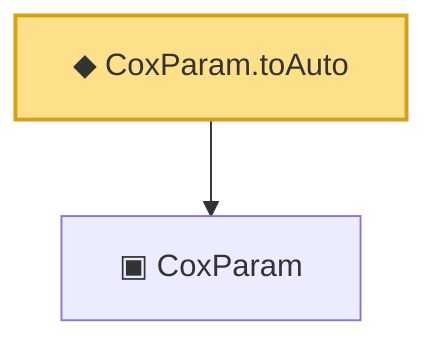

# Proof narrative — CoxParam.toAuto

Root: **CoxParam.toAuto** (def) `Statlib/CoxChangePoint/Foundation.lean:169` · topic `CoxChangePoint`
Closure: 2 declarations across 1 files. Generated from `proof_graph.json` — no files were moved.

Reading order (foundations first, headline last):

  ▣ `CoxParam` — structure · `Statlib/CoxChangePoint/Foundation.lean:57`  _(also used by 72: liftAuto, concreteGn, buildLemmaS1Data, …)_
◆ `CoxParam.toAuto` — def · `Statlib/CoxChangePoint/Foundation.lean:169` **← headline**

## Dependency diagram

