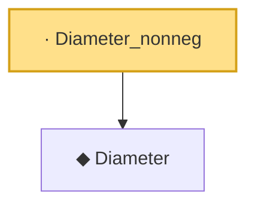

# Proof narrative — Diameter_nonneg

Root: **Diameter_nonneg** (lemma) `Statlib/CoxChangePoint/Chaining.lean:173` · topic `CoxChangePoint`
Closure: 2 declarations across 1 files. Generated from `proof_graph.json` — no files were moved.

Reading order (foundations first, headline last):

  ◆ `Diameter` — noncomputable def · `Statlib/CoxChangePoint/Chaining.lean:169`  _(also used by 1: DudleyEntropyBound)_
· `Diameter_nonneg` — lemma · `Statlib/CoxChangePoint/Chaining.lean:173` **← headline**

## Dependency diagram

