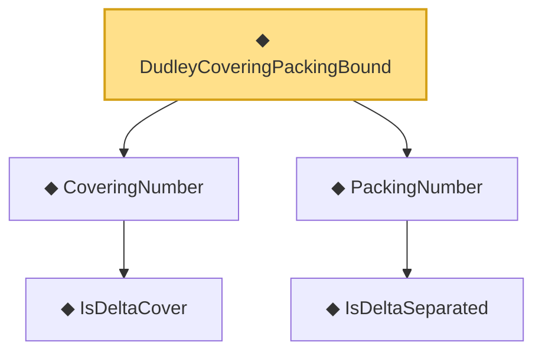

# Proof narrative — DudleyCoveringPackingBound

Root: **DudleyCoveringPackingBound** (def) `Statlib/CoxChangePoint/Chaining.lean:157` · topic `CoxChangePoint`
Closure: 5 declarations across 1 files. Generated from `proof_graph.json` — no files were moved.

Reading order (foundations first, headline last):

    ◆ `IsDeltaCover` — def · `Statlib/CoxChangePoint/Chaining.lean:61`  _(also used by 1: isDeltaCover_zero_iff)_
  ◆ `CoveringNumber` — noncomputable def · `Statlib/CoxChangePoint/Chaining.lean:70`  _(also used by 3: coveringNumber_empty, DudleyEntropyBound, CoveringLeBracketingHypothesis)_
    ◆ `IsDeltaSeparated` — def · `Statlib/CoxChangePoint/Chaining.lean:107`  _(also used by 1: isDeltaSeparated_zero)_
  ◆ `PackingNumber` — noncomputable def · `Statlib/CoxChangePoint/Chaining.lean:116`  _(also used by 1: zero_le_packingNumber)_
◆ `DudleyCoveringPackingBound` — def · `Statlib/CoxChangePoint/Chaining.lean:157` **← headline**

## Dependency diagram

