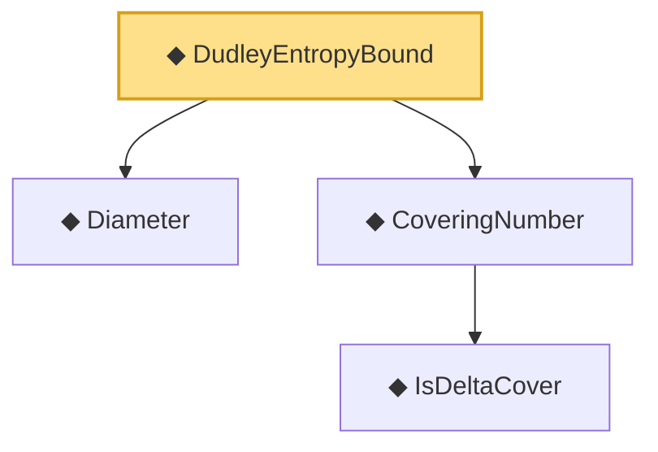

# Proof narrative — DudleyEntropyBound

Root: **DudleyEntropyBound** (def) `Statlib/CoxChangePoint/Chaining.lean:204` · topic `CoxChangePoint`
Closure: 4 declarations across 1 files. Generated from `proof_graph.json` — no files were moved.

Reading order (foundations first, headline last):

  ◆ `Diameter` — noncomputable def · `Statlib/CoxChangePoint/Chaining.lean:169`  _(also used by 1: Diameter_nonneg)_
    ◆ `IsDeltaCover` — def · `Statlib/CoxChangePoint/Chaining.lean:61`  _(also used by 1: isDeltaCover_zero_iff)_
  ◆ `CoveringNumber` — noncomputable def · `Statlib/CoxChangePoint/Chaining.lean:70`  _(also used by 3: coveringNumber_empty, DudleyCoveringPackingBound, CoveringLeBracketingHypothesis)_
◆ `DudleyEntropyBound` — def · `Statlib/CoxChangePoint/Chaining.lean:204` **← headline**

## Dependency diagram

