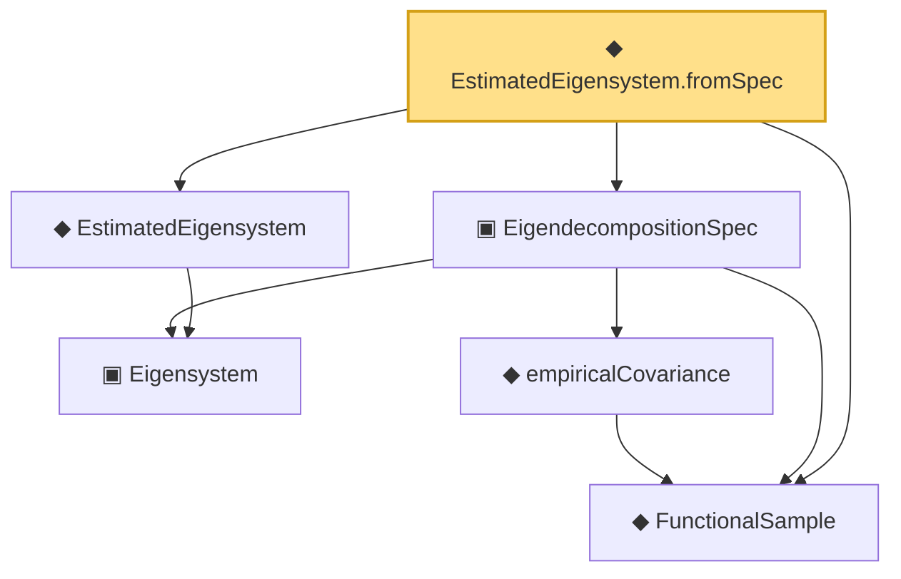

# Proof narrative — EstimatedEigensystem.fromSpec

Root: **EstimatedEigensystem.fromSpec** (def) `Statlib/CoxChangePoint/SpectralBridge.lean:98` · topic `CoxChangePoint`
Closure: 6 declarations across 2 files. Generated from `proof_graph.json` — no files were moved.

Reading order (foundations first, headline last):

  ◆ `FunctionalSample` — def · `Statlib/CoxChangePoint/FPC.lean:55`  _(also used by 12: CoxModel, fpcScore, truncatedScores, …)_
    ▣ `Eigensystem` — structure · `Statlib/CoxChangePoint/FPC.lean:42`  _(also used by 21: benchmark_eigsys, CoxModel, fpcScore, …)_
    ◆ `empiricalCovariance` — noncomputable def · `Statlib/CoxChangePoint/FPC.lean:86`  _(also used by 2: empiricalCovariance_symm, ofEmpiricalCov)_
  ▣ `EigendecompositionSpec` — structure · `Statlib/CoxChangePoint/SpectralBridge.lean:64`  _(also used by 1: toEigendecompositionSpec)_
  ◆ `EstimatedEigensystem` — def · `Statlib/CoxChangePoint/FPC.lean:98`  _(also used by 7: fpcScoreError, vScoreError, vScoreError_le_cauchy_schwarz, …)_
◆ `EstimatedEigensystem.fromSpec` — def · `Statlib/CoxChangePoint/SpectralBridge.lean:98` **← headline**

## Dependency diagram

