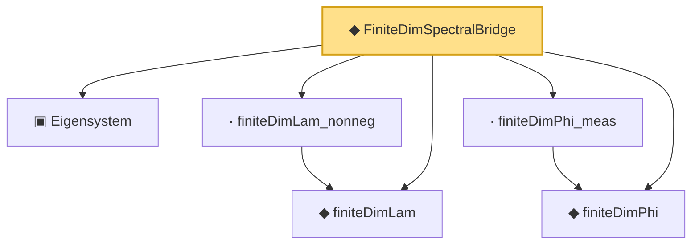

# Proof narrative — FiniteDimSpectralBridge

Root: **FiniteDimSpectralBridge** (noncomputable def) `Statlib/CoxChangePoint/SpectralTheorem.lean:163` · topic `CoxChangePoint`
Closure: 6 declarations across 2 files. Generated from `proof_graph.json` — no files were moved.

Reading order (foundations first, headline last):

  ▣ `Eigensystem` — structure · `Statlib/CoxChangePoint/FPC.lean:42`  _(also used by 22: benchmark_eigsys, CoxModel, fpcScore, …)_
  ◆ `finiteDimLam` — noncomputable def · `Statlib/CoxChangePoint/SpectralTheorem.lean:127`
  ◆ `finiteDimPhi` — noncomputable def · `Statlib/CoxChangePoint/SpectralTheorem.lean:144`
  · `finiteDimLam_nonneg` — lemma · `Statlib/CoxChangePoint/SpectralTheorem.lean:133`
  · `finiteDimPhi_meas` — lemma · `Statlib/CoxChangePoint/SpectralTheorem.lean:151`
◆ `FiniteDimSpectralBridge` — noncomputable def · `Statlib/CoxChangePoint/SpectralTheorem.lean:163` **← headline**

## Dependency diagram

