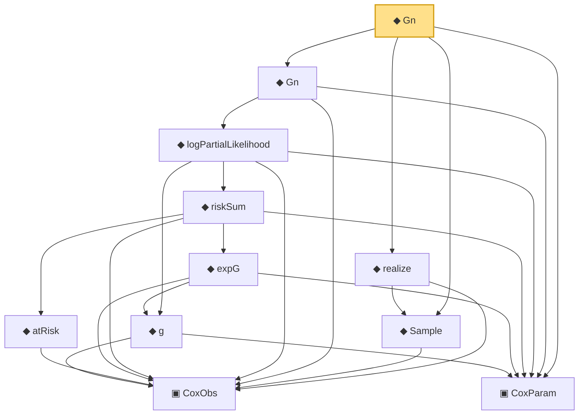

# Proof narrative — Gn

Root: **Gn** (noncomputable def) `Statlib/CoxChangePoint/Foundation.lean:139` · topic `CoxChangePoint`
Closure: 11 declarations across 1 files. Generated from `proof_graph.json` — no files were moved.

Reading order (foundations first, headline last):

    ▣ `CoxObs` — structure · `Statlib/CoxChangePoint/Foundation.lean:38`  _(also used by 35: TruncSample, benchmark_obs, coxScoreAt, …)_
  ▣ `CoxParam` — structure · `Statlib/CoxChangePoint/Foundation.lean:57`  _(also used by 68: liftAuto, concreteGn, buildLemmaS1Data, …)_
      ◆ `g` — noncomputable def · `Statlib/CoxChangePoint/Foundation.lean:68`  _(also used by 17: AssumptionA7, exponential_moment_bound, HasFirstOrderTaylor, …)_
        ◆ `atRisk` — noncomputable def · `Statlib/CoxChangePoint/Foundation.lean:89`  _(also used by 3: riskSumWeightedZ, riskSumWeightedAlpha, riskSumWeightedBeta)_
        ◆ `expG` — noncomputable def · `Statlib/CoxChangePoint/Foundation.lean:75`  _(also used by 4: expG_pos, riskSumWeightedZ, riskSumWeightedAlpha, …)_
      ◆ `riskSum` — noncomputable def · `Statlib/CoxChangePoint/Foundation.lean:93`  _(also used by 4: riskSum_nonneg, meanZ, meanAlphaInRiskSet, …)_
    ◆ `logPartialLikelihood` — noncomputable def · `Statlib/CoxChangePoint/Foundation.lean:104`  _(also used by 6: coxLogPartialLikelihoodRatio, CoxFirstOrderTaylor, IsLikelihoodArgmax, …)_
  ◆ `Gn` — noncomputable def · `Statlib/CoxChangePoint/Foundation.lean:112`  _(also used by 18: LemmaS1Data, concreteGn, buildLemmaS1Data, …)_
  ◆ `Sample` — def · `Statlib/CoxChangePoint/Foundation.lean:127`  _(also used by 22: benchmark_sample, CoxLANExpansionHypothesis, coxLogRatio, …)_
  ◆ `realize` — def · `Statlib/CoxChangePoint/Foundation.lean:135`  _(also used by 11: CoxLANExpansionHypothesis, coxLogRatio, toLANExpansion, …)_
◆ `Gn` — noncomputable def · `Statlib/CoxChangePoint/Foundation.lean:139` **← headline**

## Dependency diagram

