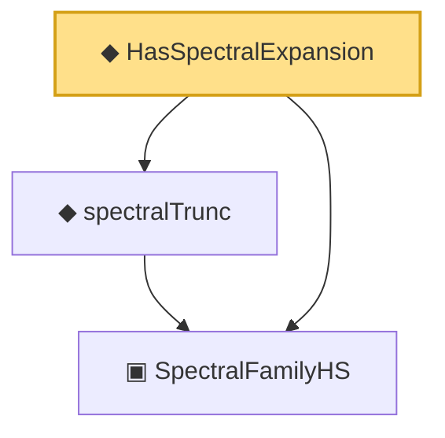

# Proof narrative — HasSpectralExpansion

Root: **HasSpectralExpansion** (def) `Statlib/CoxChangePoint/InfiniteDimSpectral.lean:289` · topic `CoxChangePoint`
Closure: 3 declarations across 1 files. Generated from `proof_graph.json` — no files were moved.

Reading order (foundations first, headline last):

  ▣ `SpectralFamilyHS` — structure · `Statlib/CoxChangePoint/InfiniteDimSpectral.lean:87`  _(also used by 13: inner_self_eq_one, inner_of_ne, norm_eigenfn, …)_
  ◆ `spectralTrunc` — noncomputable def · `Statlib/CoxChangePoint/InfiniteDimSpectral.lean:169`  _(also used by 1: norm_spectralTrunc_le)_
◆ `HasSpectralExpansion` — def · `Statlib/CoxChangePoint/InfiniteDimSpectral.lean:289` **← headline**

## Dependency diagram

