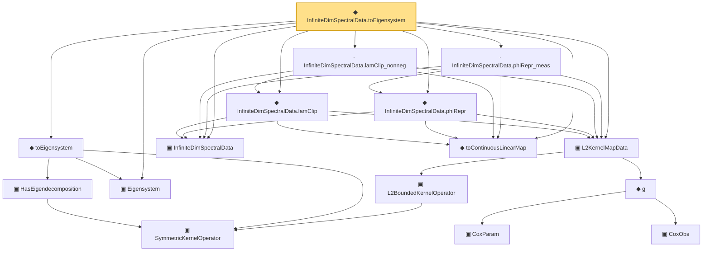

# Proof narrative — InfiniteDimSpectralData.toEigensystem

Root: **InfiniteDimSpectralData.toEigensystem** (noncomputable def) `Statlib/CoxChangePoint/SpectralTheorem.lean:282` · topic `CoxChangePoint`
Closure: 16 declarations across 6 files. Generated from `proof_graph.json` — no files were moved.

Reading order (foundations first, headline last):

    ▣ `SymmetricKernelOperator` — structure · `Statlib/CoxChangePoint/SpectralOperator.lean:103`  _(also used by 2: L2BoundedKernelOperator.ofSymmetric, ofEmpiricalCov)_
    ▣ `HasEigendecomposition` — structure · `Statlib/CoxChangePoint/SpectralOperator.lean:193`  _(also used by 1: toEigendecompositionSpec)_
  ▣ `Eigensystem` — structure · `Statlib/CoxChangePoint/FPC.lean:42`  _(also used by 21: benchmark_eigsys, CoxModel, fpcScore, …)_
  ◆ `toEigensystem` — def · `Statlib/CoxChangePoint/SpectralOperator.lean:226`  _(also used by 4: SpectralFamilyHS.toEigensystem, SpectralFamilyHS.toEigensystem_lam_summable_sq, SpectralFamilyHS.toEigensystem_lam_decreasing, …)_
    ▣ `L2BoundedKernelOperator` — structure · `Statlib/CoxChangePoint/L2Operator.lean:212`  _(also used by 6: integralAction_integral_sq_le, L2BoundedKernelOperator.ofSymmetric, integralAction_smul, …)_
      ▣ `CoxParam` — structure · `Statlib/CoxChangePoint/Foundation.lean:57`  _(also used by 72: liftAuto, concreteGn, buildLemmaS1Data, …)_
      ▣ `CoxObs` — structure · `Statlib/CoxChangePoint/Foundation.lean:38`  _(also used by 42: TruncSample, benchmark_obs, coxScoreAt, …)_
    ◆ `g` — noncomputable def · `Statlib/CoxChangePoint/Foundation.lean:68`  _(also used by 18: AssumptionA7, exponential_moment_bound, HasFirstOrderTaylor, …)_
  ▣ `L2KernelMapData` — structure · `Statlib/CoxChangePoint/L2OperatorMap.lean:204`  _(also used by 8: SpectralFamilyHS.phiRepr, SpectralFamilyHS.phiRepr_meas, SpectralFamilyHS.toEigensystem, …)_
  ▣ `InfiniteDimSpectralData` — structure · `Statlib/CoxChangePoint/SpectralTheorem.lean:188`  _(also used by 2: inner_self_eq_one, inner_of_ne)_
  ◆ `toContinuousLinearMap` — def · `Statlib/CoxChangePoint/L2OperatorMap.lean:239`  _(also used by 8: SpectralFamilyHS.phiRepr, SpectralFamilyHS.phiRepr_meas, SpectralFamilyHS.toEigensystem, …)_
  ◆ `InfiniteDimSpectralData.lamClip` — noncomputable def · `Statlib/CoxChangePoint/SpectralTheorem.lean:260`
  ◆ `InfiniteDimSpectralData.phiRepr` — noncomputable def · `Statlib/CoxChangePoint/SpectralTheorem.lean:246`
  · `InfiniteDimSpectralData.lamClip_nonneg` — lemma · `Statlib/CoxChangePoint/SpectralTheorem.lean:265`
  · `InfiniteDimSpectralData.phiRepr_meas` — lemma · `Statlib/CoxChangePoint/SpectralTheorem.lean:253`
◆ `InfiniteDimSpectralData.toEigensystem` — noncomputable def · `Statlib/CoxChangePoint/SpectralTheorem.lean:282` **← headline**

## Dependency diagram

