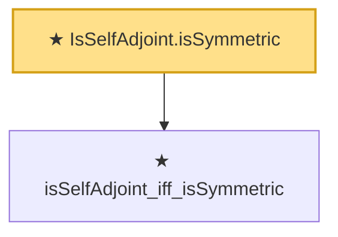

# Proof narrative — IsSelfAdjoint.isSymmetric

Root: **IsSelfAdjoint.isSymmetric** (theorem) `Statlib/CoxChangePoint/SpectralTheorem.lean:91` · topic `CoxChangePoint`
Closure: 2 declarations across 1 files. Generated from `proof_graph.json` — no files were moved.

Reading order (foundations first, headline last):

  ★ `isSelfAdjoint_iff_isSymmetric` — theorem · `Statlib/CoxChangePoint/SpectralTheorem.lean:85`  _(also used by 1: isSelfAdjoint_of_isSymmetric)_
★ `IsSelfAdjoint.isSymmetric` — theorem · `Statlib/CoxChangePoint/SpectralTheorem.lean:91` **← headline**

## Dependency diagram

