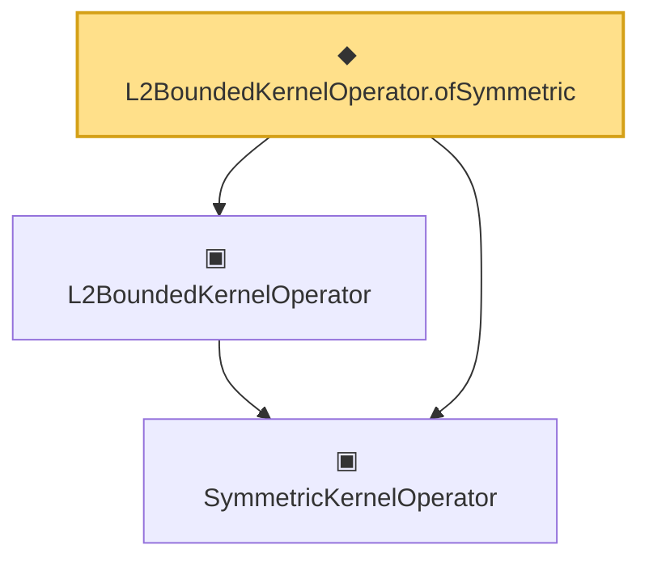

# Proof narrative — L2BoundedKernelOperator.ofSymmetric

Root: **L2BoundedKernelOperator.ofSymmetric** (noncomputable def) `Statlib/CoxChangePoint/L2Operator.lean:297` · topic `CoxChangePoint`
Closure: 3 declarations across 2 files. Generated from `proof_graph.json` — no files were moved.

Reading order (foundations first, headline last):

  ▣ `SymmetricKernelOperator` — structure · `Statlib/CoxChangePoint/SpectralOperator.lean:103`  _(also used by 3: ofEmpiricalCov, HasEigendecomposition, toEigensystem)_
  ▣ `L2BoundedKernelOperator` — structure · `Statlib/CoxChangePoint/L2Operator.lean:212`  _(also used by 6: integralAction_integral_sq_le, integralAction_smul, L2KernelMapData, …)_
◆ `L2BoundedKernelOperator.ofSymmetric` — noncomputable def · `Statlib/CoxChangePoint/L2Operator.lean:297` **← headline**

## Dependency diagram

