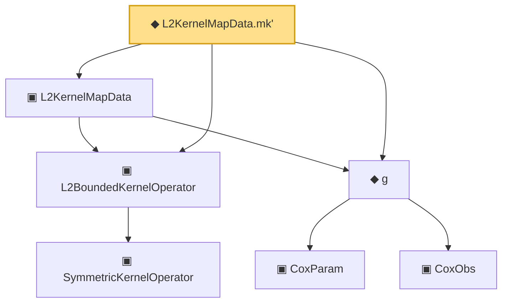

# Proof narrative — L2KernelMapData.mk'

Root: **L2KernelMapData.mk'** (def) `Statlib/CoxChangePoint/L2OperatorMap.lean:261` · topic `CoxChangePoint`
Closure: 7 declarations across 4 files. Generated from `proof_graph.json` — no files were moved.

Reading order (foundations first, headline last):

    ▣ `SymmetricKernelOperator` — structure · `Statlib/CoxChangePoint/SpectralOperator.lean:103`  _(also used by 4: L2BoundedKernelOperator.ofSymmetric, ofEmpiricalCov, HasEigendecomposition, …)_
  ▣ `L2BoundedKernelOperator` — structure · `Statlib/CoxChangePoint/L2Operator.lean:212`  _(also used by 5: integralAction_integral_sq_le, L2BoundedKernelOperator.ofSymmetric, integralAction_smul, …)_
    ▣ `CoxParam` — structure · `Statlib/CoxChangePoint/Foundation.lean:57`  _(also used by 72: liftAuto, concreteGn, buildLemmaS1Data, …)_
    ▣ `CoxObs` — structure · `Statlib/CoxChangePoint/Foundation.lean:38`  _(also used by 42: TruncSample, benchmark_obs, coxScoreAt, …)_
  ◆ `g` — noncomputable def · `Statlib/CoxChangePoint/Foundation.lean:68`  _(also used by 17: AssumptionA7, exponential_moment_bound, HasFirstOrderTaylor, …)_
  ▣ `L2KernelMapData` — structure · `Statlib/CoxChangePoint/L2OperatorMap.lean:204`  _(also used by 12: SpectralFamilyHS.phiRepr, SpectralFamilyHS.phiRepr_meas, SpectralFamilyHS.toEigensystem, …)_
◆ `L2KernelMapData.mk'` — def · `Statlib/CoxChangePoint/L2OperatorMap.lean:261` **← headline**

## Dependency diagram

