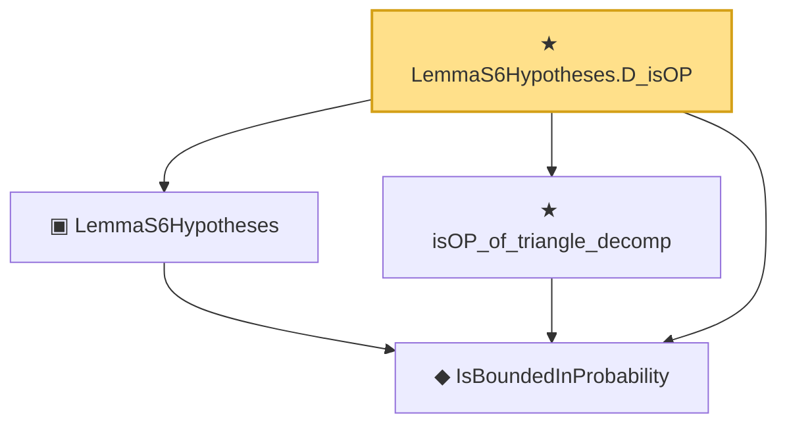

# Proof narrative — LemmaS6Hypotheses.D_isOP

Root: **LemmaS6Hypotheses.D_isOP** (theorem) `Statlib/CoxChangePoint/LemmaS6Combined.lean:182` · topic `CoxChangePoint`
Closure: 4 declarations across 2 files. Generated from `proof_graph.json` — no files were moved.

Reading order (foundations first, headline last):

  ◆ `IsBoundedInProbability` — def · `Statlib/EmpiricalProcess/StochasticOrder.lean:42`  _(also used by 18: rate, toRate, cox_theorem_2_end_to_end, …)_
  ▣ `LemmaS6Hypotheses` — structure · `Statlib/CoxChangePoint/LemmaS6Combined.lean:155`
  ★ `isOP_of_triangle_decomp` — theorem · `Statlib/CoxChangePoint/LemmaS6Combined.lean:65`
★ `LemmaS6Hypotheses.D_isOP` — theorem · `Statlib/CoxChangePoint/LemmaS6Combined.lean:182` **← headline**

## Dependency diagram

