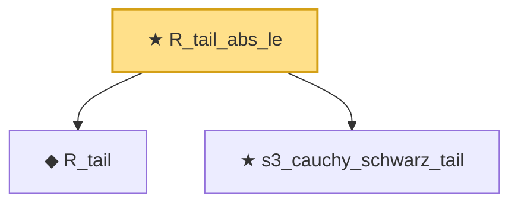

# Proof narrative — R_tail_abs_le

Root: **R_tail_abs_le** (theorem) `Statlib/CoxChangePoint/RemainderTailOp.lean:77` · topic `CoxChangePoint`
Closure: 3 declarations across 2 files. Generated from `proof_graph.json` — no files were moved.

Reading order (foundations first, headline last):

  ◆ `R_tail` — def · `Statlib/CoxChangePoint/RemainderTailOp.lean:33`
  ★ `s3_cauchy_schwarz_tail` — theorem · `Statlib/CoxChangePoint/S3CauchySchwarzTail.lean:22`
★ `R_tail_abs_le` — theorem · `Statlib/CoxChangePoint/RemainderTailOp.lean:77` **← headline**

## Dependency diagram

