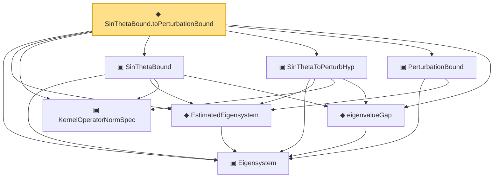

# Proof narrative — SinThetaBound.toPerturbationBound

Root: **SinThetaBound.toPerturbationBound** (def) `Statlib/CoxChangePoint/SinThetaTheorem.lean:191` · topic `CoxChangePoint`
Closure: 8 declarations across 3 files. Generated from `proof_graph.json` — no files were moved.

Reading order (foundations first, headline last):

  ▣ `Eigensystem` — structure · `Statlib/CoxChangePoint/FPC.lean:42`  _(also used by 17: benchmark_eigsys, CoxModel, fpcScore, …)_
  ◆ `EstimatedEigensystem` — def · `Statlib/CoxChangePoint/FPC.lean:98`  _(also used by 4: fpcScoreError, vScoreError, vScoreError_le_cauchy_schwarz, …)_
  ▣ `KernelOperatorNormSpec` — structure · `Statlib/CoxChangePoint/SinThetaTheorem.lean:80`
  ◆ `eigenvalueGap` — def · `Statlib/CoxChangePoint/SinThetaTheorem.lean:98`
  ▣ `SinThetaBound` — structure · `Statlib/CoxChangePoint/SinThetaTheorem.lean:118`
  ▣ `SinThetaToPerturbHyp` — structure · `Statlib/CoxChangePoint/SinThetaTheorem.lean:158`
  ▣ `PerturbationBound` — structure · `Statlib/CoxChangePoint/SpectralBridge.lean:126`
◆ `SinThetaBound.toPerturbationBound` — def · `Statlib/CoxChangePoint/SinThetaTheorem.lean:191` **← headline**

## Dependency diagram

