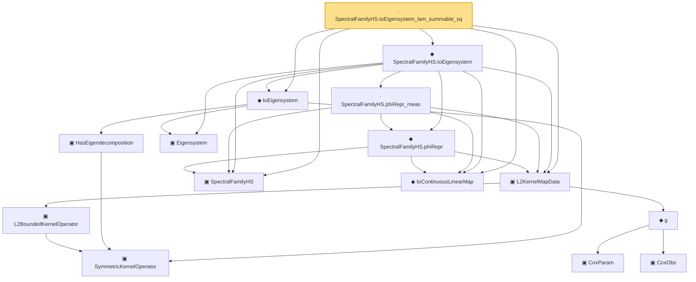

# Proof narrative — SpectralFamilyHS.toEigensystem_lam_summable_sq

Root: **SpectralFamilyHS.toEigensystem_lam_summable_sq** (lemma) `Statlib/CoxChangePoint/InfiniteDimSpectral.lean:331` · topic `CoxChangePoint`
Closure: 15 declarations across 6 files. Generated from `proof_graph.json` — no files were moved.

Reading order (foundations first, headline last):

      ▣ `SymmetricKernelOperator` — structure · `Statlib/CoxChangePoint/SpectralOperator.lean:103`  _(also used by 2: L2BoundedKernelOperator.ofSymmetric, ofEmpiricalCov)_
    ▣ `L2BoundedKernelOperator` — structure · `Statlib/CoxChangePoint/L2Operator.lean:212`  _(also used by 6: integralAction_integral_sq_le, L2BoundedKernelOperator.ofSymmetric, integralAction_smul, …)_
      ▣ `CoxParam` — structure · `Statlib/CoxChangePoint/Foundation.lean:57`  _(also used by 72: liftAuto, concreteGn, buildLemmaS1Data, …)_
      ▣ `CoxObs` — structure · `Statlib/CoxChangePoint/Foundation.lean:38`  _(also used by 42: TruncSample, benchmark_obs, coxScoreAt, …)_
    ◆ `g` — noncomputable def · `Statlib/CoxChangePoint/Foundation.lean:68`  _(also used by 18: AssumptionA7, exponential_moment_bound, HasFirstOrderTaylor, …)_
  ▣ `L2KernelMapData` — structure · `Statlib/CoxChangePoint/L2OperatorMap.lean:204`  _(also used by 9: SpectralFamilyHS.toEigensystem_lam_decreasing, opNorm_le, L2KernelMapData.mk', …)_
  ▣ `SpectralFamilyHS` — structure · `Statlib/CoxChangePoint/InfiniteDimSpectral.lean:87`  _(also used by 11: inner_self_eq_one, inner_of_ne, norm_eigenfn, …)_
  ◆ `toContinuousLinearMap` — def · `Statlib/CoxChangePoint/L2OperatorMap.lean:239`  _(also used by 9: SpectralFamilyHS.toEigensystem_lam_decreasing, opNorm_le, InfiniteDimSpectralData.phiRepr, …)_
      ▣ `HasEigendecomposition` — structure · `Statlib/CoxChangePoint/SpectralOperator.lean:193`  _(also used by 1: toEigendecompositionSpec)_
    ▣ `Eigensystem` — structure · `Statlib/CoxChangePoint/FPC.lean:42`  _(also used by 21: benchmark_eigsys, CoxModel, fpcScore, …)_
  ◆ `toEigensystem` — def · `Statlib/CoxChangePoint/SpectralOperator.lean:226`  _(also used by 3: SpectralFamilyHS.toEigensystem_lam_decreasing, toEigendecompositionSpec, InfiniteDimSpectralData.toEigensystem)_
    ◆ `SpectralFamilyHS.phiRepr` — noncomputable def · `Statlib/CoxChangePoint/InfiniteDimSpectral.lean:306`
    · `SpectralFamilyHS.phiRepr_meas` — lemma · `Statlib/CoxChangePoint/InfiniteDimSpectral.lean:313`
  ◆ `SpectralFamilyHS.toEigensystem` — noncomputable def · `Statlib/CoxChangePoint/InfiniteDimSpectral.lean:321`  _(also used by 1: SpectralFamilyHS.toEigensystem_lam_decreasing)_
· `SpectralFamilyHS.toEigensystem_lam_summable_sq` — lemma · `Statlib/CoxChangePoint/InfiniteDimSpectral.lean:331` **← headline**

## Dependency diagram

