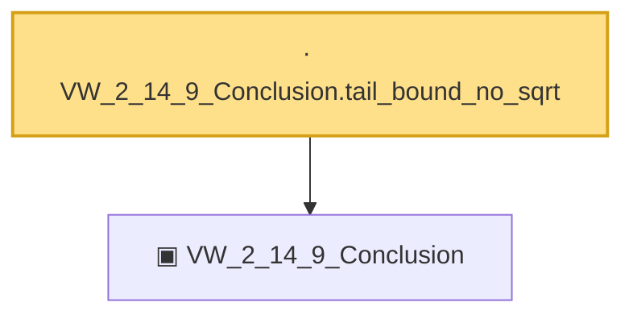

# Proof narrative — VW_2_14_9_Conclusion.tail_bound_no_sqrt

Root: **VW_2_14_9_Conclusion.tail_bound_no_sqrt** (lemma) `Statlib/CoxChangePoint/ChainingProof.lean:245` · topic `CoxChangePoint`
Closure: 2 declarations across 1 files. Generated from `proof_graph.json` — no files were moved.

Reading order (foundations first, headline last):

  ▣ `VW_2_14_9_Conclusion` — structure · `Statlib/CoxChangePoint/ChainingProof.lean:226`  _(also used by 8: unifConv_of_VW_2_14_9_conclusion, toConclusion, CoxBaselineHypotheses.hUnif_from_VW_2_14_9, …)_
· `VW_2_14_9_Conclusion.tail_bound_no_sqrt` — lemma · `Statlib/CoxChangePoint/ChainingProof.lean:245` **← headline**

## Dependency diagram

